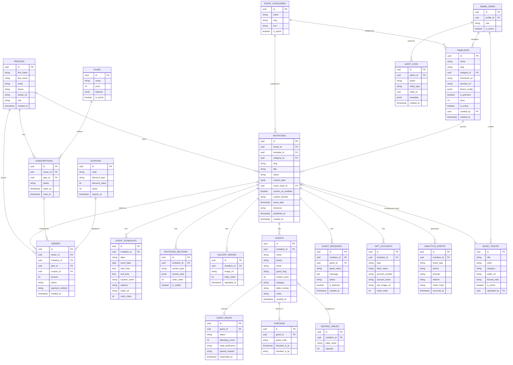

# AVELORA
## Product Requirements Document (PRD) & Entity Relationship Diagram (ERD)
**Versi:** 1.0 · **Tanggal:** 18 September 2026 · **Status:** Draft untuk pengembangan MVP (Web Platform)

---

## 1. Ringkasan Eksekutif

**AVELORA** adalah platform undangan digital berbasis web yang memungkinkan pengguna membuat, mengelola, mempersonalisasi, dan membagikan undangan untuk berbagai jenis acara — pernikahan, aqiqah, khitan, ulang tahun, wisuda, hingga acara korporat.

Berbeda dari kompetitor yang berhenti di "buat undangan → share link", AVELORA dibangun sebagai **event experience platform**: dari pembuatan undangan, personalisasi per tamu, RSVP, pengelolaan tamu, hingga dokumentasi setelah acara selesai.

Fase pertama yang disepakati: **fokus ke Website (web app) dulu**, dengan kualitas visual "keren habis" (premium, cinematic, bukan template CRUD biasa), fitur **live preview** saat mengedit, **musik/nasheed yang bisa diganti**, dan **template hanya bisa ditambahkan oleh Admin** (user tidak bisa upload template sendiri di MVP).

---

## 2. Latar Belakang & Masalah

### 2.1 Masalah pada undangan konvensional
| Masalah | Dampak |
|---|---|
| Biaya cetak & distribusi | Mahal, terutama untuk tamu banyak |
| Sulit update informasi (misal lokasi berubah) | Info salah tersebar, tidak bisa direvisi |
| RSVP manual (telepon/WA japri) | Tidak terstruktur, sulit direkap |
| Tidak tahu siapa yang benar-benar hadir | Perencanaan katering/kursi meleset |
| Tidak ada integrasi lokasi | Tamu tersesat |
| Dokumentasi tersebar di banyak HP tamu | Kenangan acara tidak terkumpul |

### 2.2 Masalah pada kompetitor undangan digital existing
- Rata-rata cuma landing page statis + countdown + galeri — semua terasa sama.
- Template terasa seperti "template website", bukan undangan yang personal.
- Tidak ada pengelolaan tamu yang layak (sekadar list nama).
- Tidak ada continuity setelah acara selesai (link mati begitu acara lewat).

### 2.3 Peluang
Pasar undangan digital Indonesia besar dan terus tumbuh (WhatsApp-first culture), tapi kualitas produk yang ada rata-rata "cukup", bukan "menonjol". Ruang untuk diferensiasi ada di: **desain premium + personalisasi per tamu + pengalaman tamu end-to-end**.

---

## 3. Visi & Tujuan Produk

**Visi:**
> "Satu platform untuk merancang, membagikan, dan mengenang setiap momen penting — dengan kualitas desain setara studio premium."

**Tujuan MVP (Fase Web):**
1. User bisa membuat undangan digital untuk minimal 3 kategori acara (Wedding, Aqiqah/Khitan, Birthday) dalam < 15 menit tanpa skill desain.
2. Undangan yang dihasilkan terlihat premium — bukan "template website kaku".
3. Ada live preview real-time saat user mengedit.
4. Ada sistem musik/nasheed yang bisa dipilih & diganti user.
5. Template hanya bisa dikelola Admin, dengan arsitektur yang scalable untuk ratusan–ribuan template ke depan.
6. Tamu bisa RSVP, kasih ucapan, dan lihat undangan yang personal (nama tamu muncul otomatis).
7. Ada dashboard admin untuk mengelola user, template, order, dan konten.

### 3.1 Non-Goals (di luar scope MVP ini)
- Aplikasi mobile native (iOS/Android) — menyusul di fase berikutnya.
- User self-upload template custom.
- Live streaming acara.
- Reseller/white-label (masuk roadmap fase lanjutan, lihat §13).

---

## 4. Target Pengguna & Persona

| Persona | Deskripsi | Kebutuhan Utama |
|---|---|---|
| **Calon Pengantin (Primary)** | 22–35 tahun, melek digital, ingin undangan terlihat "elegant & Instagrammable" | Desain bagus, mudah dipakai, harga terjangkau |
| **Orang Tua yang bikinkan acara anak (Aqiqah/Khitan)** | 35–55 tahun, kurang melek teknologi | UX sangat sederhana, WhatsApp integration, bisa dibantu vendor/EO |
| **Wedding Organizer / Vendor** | Membuatkan undangan untuk banyak klien | Multi-invitation per akun, nanti reseller |
| **Tamu Undangan** | Semua umur, akses dari WhatsApp | Loading cepat, jelas tanggal/lokasi, mudah RSVP |
| **Admin AVELORA** | Tim internal | Kontrol penuh atas template, user, order, konten |

---

## 5. Prinsip Desain Produk

1. **Editorial, bukan Corporate.** Tipografi besar & elegan, foto full-bleed, banyak white space — bukan tumpukan card & tombol seperti landing page SaaS generik.
2. **Personal by default.** Setiap tamu yang buka link merasa undangan itu "dibuat khusus untuknya" (nama otomatis muncul).
3. **Cepat & ringan.** Undangan diakses mayoritas dari mobile browser via WhatsApp — wajib loading cepat meski banyak foto/musik.
4. **WhatsApp-first.** Semua flow share dioptimalkan untuk WhatsApp (bukan cuma tombol share generik).
5. **Admin-controlled quality.** Karena template dikontrol admin, kualitas visual terjaga — tidak ada template jelek yang lolos ke katalog publik.

---

## 6. Ruang Lingkup Fitur (MVP — Web Platform)

```
AVELORA (Web)
│
├── Public Site
│   ├── Landing Page
│   ├── Template Gallery (katalog publik, bisa difilter kategori acara)
│   ├── Pricing
│   └── Halaman Undangan Publik (avelora.id/[slug])
│
├── Auth
│   ├── Register / Login (Email + Google)
│   ├── Forgot/Reset Password
│   └── Email Verification
│
├── User Dashboard
│   ├── My Invitations
│   ├── Invitation Builder (dengan Live Preview)
│   ├── Guest Management & RSVP
│   ├── Guestbook Moderation
│   ├── Analytics
│   ├── Music Picker
│   └── Billing/Upgrade
│
├── Admin Panel
│   ├── User Management
│   ├── Template Management (CRUD — admin only)
│   ├── Category Management
│   ├── Music Library Management
│   ├── Order & Payment
│   ├── Coupon
│   ├── Reports & Analytics
│   └── Content (Blog/FAQ/Testimonials)
│
└── Core Services
    ├── Invitation Engine (rendering per-guest personalization)
    ├── RSVP Engine
    ├── Notification (email/WA)
    └── Payment/Entitlement
```

---

## 7. Functional Requirements — Detail per Modul

Setiap fitur ditulis dengan **User Story** + **Acceptance Criteria (AC)** biar langsung bisa dipakai jadi tiket development.

### 7.1 Landing Page & Public Site

**US-01** — Sebagai pengunjung, saya ingin melihat landing page yang meyakinkan saya bahwa AVELORA berkualitas premium.

AC:
- Hero section dengan headline, sub-headline, CTA "Buat Undangan" & "Lihat Template".
- Section: Template Showcase (carousel/gallery, filter per kategori acara), How It Works (3–4 langkah), Feature Highlights, Kategori Acara, Pricing, Testimoni, FAQ, CTA akhir, Footer.
- Performance: LCP < 2.5s di koneksi 4G.
- Fully responsive (mobile-first, karena traffic dari WA didominasi mobile).

**US-02** — Sebagai pengunjung, saya ingin browse katalog template sebelum daftar.

AC:
- Filter by kategori acara (Wedding, Aqiqah, Khitan, Birthday, Graduation, Corporate, Custom).
- Filter by tier (Free/Basic/Premium/Pro).
- Setiap template card menampilkan thumbnail, nama, kategori, badge tier, tombol "Preview".
- Klik "Preview" membuka **live demo undangan** (data dummy) di tab baru — bukan cuma gambar statis.

### 7.2 Autentikasi

**US-03** — Sebagai user baru, saya ingin daftar dengan email atau Google.

AC:
- Field: first_name, last_name, email, phone, password.
- Validasi email unik, password minimal 8 karakter + kombinasi.
- Setelah register, email verifikasi dikirim; akun berstatus `unverified` sampai email dikonfirmasi (tetap bisa login tapi ada banner reminder).
- Login via Google OAuth (Supabase Auth provider).
- Forgot Password → kirim link reset via email, token expired 30 menit.

### 7.3 User Dashboard

**US-04** — Sebagai user, saya ingin melihat ringkasan semua undangan saya begitu login.

AC:
- Menampilkan: total invitation, invitation aktif/published, total views (gabungan), total RSVP, total tamu.
- List invitation card: nama acara, kategori, status (Draft/Published/Expired), views, RSVP count, tombol Manage/Edit/Preview/Share.
- Tombol "+ Buat Undangan Baru" selalu terlihat (sticky/prominent).

### 7.4 Invitation Builder — Jantung Produk

**US-05** — Sebagai user, saya ingin membuat undangan baru dengan alur yang jelas: pilih jenis acara → pilih template → kustomisasi → preview → publish.

AC — Step 1 (Pilih Jenis Acara):
- Pilihan: Wedding, Engagement, Aqiqah, Khitan, Birthday, Graduation, Corporate, Other.
- Pilihan ini menentukan **field & section apa saja yang muncul** di editor (lihat §7.4.1 "Event Type Adaptive").

AC — Step 2 (Pilih Template):
- Hanya menampilkan template yang aktif (`is_active = true`) dan sesuai kategori acara yang dipilih.
- Template premium ditandai badge + harga; bisa tetap dipilih tapi publish akan diblokir sampai user upgrade/bayar (lihat §7.13 Payment).

AC — Step 3 (Customize / Editor):
- **Live Preview** wajib ada di sisi editor (split-screen desktop: form kiri, preview kanan real-time; mobile: tab switch "Edit" / "Preview").
- Setiap perubahan field ter-reflect ke preview dalam < 300ms (client-side state, tanpa perlu save dulu).
- Auto-save draft setiap perubahan (debounced, misal 2 detik setelah user berhenti mengetik) + tombol "Save" manual.

AC — Step 4 (Preview Penuh):
- User bisa buka preview dalam mode "seolah-olah jadi tamu", termasuk cek tampilan mobile.
- Preview bisa dibuka via link khusus yang tidak publik/tidak terindex (`?preview=true&token=...`) untuk dibagikan ke calon user cek dulu sebelum publish.

AC — Step 5 (Publish):
- Validasi field wajib terisi (nama acara, tanggal, minimal 1 lokasi) sebelum publish diaktifkan.
- Setelah publish, sistem generate slug unik: `avelora.id/{slug}` (default dari nama, user bisa edit slug jika tier mengizinkan custom URL).
- Undangan yang sudah publish tetap bisa diedit (perubahan langsung live).

#### 7.4.1 Event Type Adaptive (Section per kategori)

| Kategori | Section yang muncul otomatis |
|---|---|
| Wedding | Cover, Mempelai (Couple), Our Story, Akad & Resepsi (multi-schedule), Lokasi, Countdown, Galeri, RSVP, Amplop Digital, Guestbook, Musik |
| Aqiqah / Khitan | Cover, Nama Anak & Orang Tua, Acara & Jadwal, Lokasi, Countdown, Galeri, RSVP, Amplop Digital (opsional), Guestbook |
| Birthday | Cover, Nama & Usia, Galeri, Jadwal, Lokasi, RSVP, Gift Registry, Guestbook |
| Graduation | Cover, Nama Wisudawan, Jadwal, Lokasi, Galeri, RSVP |
| Corporate | Cover, Nama Acara, Agenda/Speaker, Lokasi, Registrasi/Ticket, Check-in |
| Custom | User bebas susun dari Block Builder (§7.4.2) |

#### 7.4.2 Block-Based Editor (Fase 1.5 — setelah editor form dasar stabil)
Selain form terstruktur per event type, sediakan mode **block builder** (mirip Notion-style) supaya user power-user bisa reorder/tambah/hapus section: Cover, Text, Event, Countdown, Gallery, Story, Map, RSVP, Gift, Guestbook, Video, Custom HTML (khusus tier Pro, dengan sanitasi ketat untuk keamanan).

### 7.5 Konten Undangan (Field Detail)

**Cover**
- Judul (default: nama-nama, editable).
- Foto cover (upload, crop otomatis rasio disarankan 4:5 / 9:16).
- Teks pembuka (opsional preset seperti Basmalah untuk acara islami, atau custom teks).

**Data Acara** (contoh Wedding)
- Nama mempelai pria & wanita, nama orang tua masing-masing.
- Multi-jadwal (Akad, Resepsi, dst) masing-masing punya: nama acara, tanggal, jam mulai, jam selesai, lokasi terkait.

**Our Story** (opsional, timeline)
- List item: judul (First Meeting, First Date, dst), tanggal, deskripsi, foto.

**Galeri**
- Upload multi-foto, drag-drop reorder, delete.
- Auto-compress & convert ke WebP saat upload (untuk performa).
- Limit jumlah foto sesuai tier (Free: 5, Basic: 15, Premium: 50, Pro: unlimited).

**Lokasi**
- Multi-lokasi (misal Akad beda tempat dengan Resepsi).
- Field: nama venue, alamat lengkap, link Google Maps, embed map.
- Tombol "Buka di Google Maps" / "Petunjuk Arah".

**Countdown**
- Real-time countdown ke tanggal acara utama.
- Timezone-aware (WIB/WITA/WIT) berdasarkan lokasi acara, bukan device tamu.

**RSVP** — detail di §7.6.

**Amplop Digital / Gift**
- List rekening bank (nama bank, no rekening, atas nama) — bisa lebih dari satu.
- Dukungan QRIS (upload gambar QRIS statis) & e-wallet.
- Tombol "Salin nomor rekening".
- ⚠️ Data ini sensitif secara persepsi (uang) meski bukan data pembayaran kartu — tetap harus disimpan dengan akses terbatas (hanya pemilik invitation & admin dengan audit log, lihat §10 Security).

**Guestbook**
- Tamu isi nama + ucapan.
- Default masuk status `pending`, owner undangan bisa approve/reject/delete dari dashboard (anti-spam).
- Owner bisa toggle "auto-approve" jika mau tanpa moderasi.

**Musik / Nasheed** — detail di §7.7.

### 7.6 RSVP & Guest Management

**US-06** — Sebagai owner undangan, saya ingin tahu siapa saja yang akan hadir.

AC:
- Owner bisa **pre-input daftar tamu** (manual entry / import CSV) sebelum share — ini yang mengaktifkan fitur personalisasi (§7.8).
- Tamu yang buka link dengan parameter guest bisa langsung RSVP tanpa isi ulang nama.
- Tamu yang buka link tanpa parameter guest (link umum) tetap bisa RSVP dengan isi nama sendiri.
- Form RSVP dasar: Hadir / Tidak Hadir / Mungkin, jumlah tamu.
- Form RSVP lanjutan (tier Premium+, configurable per event type): preferensi menu, kebutuhan akomodasi, catatan khusus.
- Data guest tersimpan dengan status: `pending`, `attending`, `not_attending`, `maybe`.
- Owner bisa lihat & filter list tamu, export ke CSV/Excel (tier tertentu).

### 7.7 Musik / Nasheed

**US-07** — Sebagai owner undangan, saya ingin memilih musik latar dan bisa menggantinya kapan saja.

AC:
- Ada **Music Library** terkuratasi oleh admin (lisensi jelas — tidak sembarang lagu berhak cipta, sesuai catatan di dokumen sumber).
- User memilih dari library (kategori: Islami/Nasheed, Instrumental, Pop Cover, Acoustic, dst) via dropdown/preview player di editor.
- Tier Premium+: user bisa **upload musik sendiri** (format mp3, max durasi & ukuran dibatasi, dengan disclaimer hak cipta yang harus disetujui user).
- Di halaman undangan publik: player musik default **muted-autoplay** dengan tombol unmute besar & jelas (menghormati kebijakan browser autoplay + UX yang tidak mengagetkan tamu).
- Kontrol player: play/pause, volume, minimal invasif secara visual (floating button, bukan bar besar).

### 7.8 Personalized Invitation Engine

**US-08** — Sebagai tamu, saya ingin undangan yang saya buka terasa personal (ada nama saya).

AC:
- URL format: `avelora.id/{slug}?to={guest_slug}` atau `avelora.id/{slug}/{guest_slug}`.
- Sistem mencocokkan `guest_slug` ke data guest di database invitation tsb.
- Jika match: tampilkan "Kepada Yth. {nama tamu}" di bagian awal, dan RSVP form otomatis ter-prefill nama & jumlah tamu yang diundang (bisa diedit tamu jika perlu).
- Jika tidak match / parameter kosong: tampilkan undangan versi umum (tanpa nama personal).
- Generate link personal per tamu bisa dilakukan massal dari dashboard (bulk generate + bulk copy/export untuk broadcast WA).

### 7.9 WhatsApp Integration

**US-09** — Sebagai owner, saya ingin membagikan undangan ke tamu lewat WhatsApp dengan pesan yang sudah jadi.

AC:
- Tombol "Share via WhatsApp" generate pesan template (bisa diedit) berisi salam pembuka + info singkat acara + link undangan.
- Untuk tier Premium+: generate pesan **personal per tamu** (menyapa nama tamu) + link personal, siap di-copy satu-satu atau (fase lanjutan) broadcast via WA Business API.
- Deep link `wa.me/?text=...` untuk share langsung dari dashboard.

### 7.10 Analytics

**US-10** — Sebagai owner, saya ingin tahu performa undangan saya.

AC (tier Premium+):
- Metrik: total views, unique visitors, RSVP rate, breakdown attending/not attending/maybe, device (mobile/desktop), browser, referral source (khususnya WhatsApp vs direct vs lainnya), views per hari (grafik line chart).
- Tier Basic/Free: hanya lihat total views & total RSVP dasar.

### 7.11 QR Check-in & Seating (Fase 2 — Pro tier)

AC:
- Setiap guest yang RSVP `attending` otomatis dapat kode unik (`guest_code`, contoh: `AVL-92832`) + QR code.
- Halaman khusus "Scan QR" (bisa diakses dari HP panitia) untuk check-in saat hari-H: scan → tampilkan nama, jumlah tamu, nomor meja (jika ada) → tombol konfirmasi check-in.
- Dashboard real-time: Total Invited, Confirmed, Checked In, No Show.
- Seating (opsional): owner assign tamu ke nomor meja dari dashboard; tamu bisa lihat "Meja Anda: 07" di halaman undangan/QR mereka.

### 7.12 Event Memory (Fase 2)

AC:
- Setelah tanggal acara lewat, undangan otomatis berubah tampilan ke mode "Kenangan" (bukan hilang/dihapus): ringkasan foto, jumlah ucapan, jumlah tamu hadir.
- Tamu bisa upload foto dokumentasi mereka sendiri ke galeri kolaboratif (moderasi oleh owner).

### 7.13 Payment & Entitlement (Fase Monetisasi)

> **Penting:** Untuk MVP, **jangan bangun payment gateway dulu**. Bangun dulu sistem **entitlement/subscription** (tabel `plans`, `subscriptions`, `orders`) supaya integrasi gateway (Midtrans/Xendit) tinggal dicolok belakangan tanpa refactor besar.

AC:
- User pilih plan (Free/Basic/Premium/Pro) saat mau publish/upgrade.
- Sistem cek entitlement sebelum mengizinkan aksi premium (pilih template premium, custom URL, remove watermark, dst) — logic terpusat, bukan tersebar di banyak tempat.
- Riwayat order & invoice terlihat di dashboard user.

### 7.14 Admin Panel

**US-11** — Sebagai admin, saya satu-satunya yang bisa menambah/mengelola template.

AC — Template Management:
- CRUD template: nama, slug, kategori, thumbnail, preview_url/demo data, theme_config (JSON: palet warna, font, layout variant), is_premium, price, is_active.
- Toggle publish/unpublish tanpa hapus data.
- Preview template dari admin panel sebelum dipublish ke katalog.

AC — Lainnya:
- User Management: lihat/suspend/hapus user, lihat invitation milik user.
- Category Management: kelola kategori acara.
- Music Library Management: upload/kelola track musik + metadata lisensi.
- Order & Payment: lihat semua transaksi, status pembayaran.
- Coupon: buat kode diskon (persentase/nominal, masa berlaku, kuota).
- Reports & Analytics: total user, total invitation, revenue, growth chart.
- Content: kelola Blog, FAQ, Testimonials di landing page.
- Admin Users: role-based (Super Admin, Content Admin, Support) — lihat §10.

### 7.15 Notifikasi

AC:
- User dapat notifikasi in-app + email untuk: RSVP baru masuk, pembayaran berhasil, invitation akan expired (jika ada masa aktif).
- Admin dapat notifikasi: order baru, pembayaran baru, user baru mendaftar, laporan konten (guestbook di-flag).

---

## 8. Non-Functional Requirements

| Kategori | Requirement |
|---|---|
| **Performance** | Halaman undangan publik: LCP < 2.5s di 4G; gambar lazy-load & di-serve via CDN/optimized format (WebP/AVIF) |
| **Scalability** | Desain database & storage siap untuk ribuan invitation aktif & puluhan ribu guest records |
| **Security** | Lihat §10 detail (RLS, rate limiting, validasi input, dst) |
| **SEO** | Landing page & template gallery SEO-friendly (meta tags, sitemap, structured data); halaman undangan individual **noindex** by default (privasi tamu) kecuali owner mengizinkan |
| **Accessibility** | Kontras warna cukup, alt text foto, form accessible via keyboard |
| **Availability** | Uptime target 99.5%+ untuk halaman publik (karena diakses tamu real-time saat acara) |
| **Localization** | Bahasa Indonesia sebagai default; struktur i18n-ready untuk Bahasa Inggris ke depan |
| **Data retention** | Invitation & data tamu disimpan minimal 1 tahun setelah tanggal acara (untuk fitur Event Memory) |

---

## 9. Information Architecture (Sitemap)

```
avelora.id/
├── /                          → Landing Page
├── /templates                 → Template Gallery (publik)
├── /templates/[slug]/preview  → Live demo template (data dummy)
├── /pricing
├── /login  /register  /forgot-password  /reset-password
├── /dashboard                 → User Dashboard (auth)
│   ├── /dashboard/invitations
│   ├── /dashboard/invitations/new           → Builder step 1-2
│   ├── /dashboard/invitations/[id]/edit     → Builder step 3 (live preview)
│   ├── /dashboard/invitations/[id]/guests
│   ├── /dashboard/invitations/[id]/analytics
│   ├── /dashboard/invitations/[id]/guestbook
│   ├── /dashboard/billing
│   └── /dashboard/profile
├── /admin                     → Admin Panel (auth + role admin)
│   ├── /admin/users
│   ├── /admin/templates
│   ├── /admin/categories
│   ├── /admin/music
│   ├── /admin/orders
│   ├── /admin/coupons
│   ├── /admin/reports
│   └── /admin/content
└── /[slug]                    → Halaman Undangan Publik
    └── /[slug]?to=[guest_slug] atau /[slug]/[guest_slug]  → Versi personal
```

---

## 10. Keamanan & Privasi (Wajib, Bukan "Nice to Have")

1. **Authentication & Authorization** — Supabase Auth (email + OAuth Google). Role-based access: `user`, `admin_content`, `admin_super`.
2. **Row Level Security (RLS)** — karena pakai Supabase Postgres:
   - User hanya bisa CRUD invitation miliknya sendiri.
   - Guest data hanya bisa diakses owner invitation terkait + admin.
   - Template hanya bisa di-CRUD oleh role admin (RLS policy cek `role = 'admin'` di tabel profiles).
3. **Rate limiting** — endpoint RSVP publik & guestbook publik wajib di-rate-limit (cegah spam/bot).
4. **Input validation & sanitization** — terutama di field bebas teks (Our Story, Guestbook, Custom HTML block) untuk cegah XSS.
5. **CSRF protection** — sesuai mekanisme Next.js Server Actions / API routes.
6. **Secure file upload** — validasi tipe file (image/audio only sesuai konteks), validasi ukuran, scan dasar sebelum simpan ke storage, generate nama file acak (bukan nama asli user).
7. **Data rekening/gift** — akses dibatasi hanya owner invitation; jangan expose di API publik yang tidak perlu (misal endpoint publik hanya kirim data gift saat section itu memang aktif ditampilkan, tidak all-fields dump).
8. **Audit log** — aksi sensitif (admin ubah/hapus template, admin akses data user) tercatat di tabel `audit_logs`.
9. **Backup** — automated daily backup database.
10. **Privasi tamu** — halaman undangan individual default `noindex,nofollow` supaya tidak terindex Google (data tamu tidak jadi konsumsi publik luas).

---

## 11. ERD (Entity Relationship Diagram)

### 11.1 Diagram Mermaid



### 11.2 Catatan Desain Skema

- **`content_data` (jsonb) di tabel `invitations`** menyimpan field-field dinamis sesuai `event_type` (misal nama mempelai untuk Wedding, nama anak untuk Aqiqah). Ini menghindari kebutuhan tabel terpisah per jenis acara, sekaligus fleksibel untuk kategori baru di masa depan tanpa migrasi skema besar. Field yang **wajib divalidasi di aplikasi layer** (bukan DB) sesuai `category_id`.
- **`theme_config` (jsonb) di tabel `templates`** menyimpan definisi visual: palet warna, kombinasi font, layout variant, animasi. Struktur ini yang menjadi basis "Template Scaling Strategy" di §12 — 1 kode template bisa menghasilkan puluhan varian tampilan hanya dari perbedaan `theme_config`.
- **`invitation_sections`** dipakai jika mode Block Builder (§7.4.2) diaktifkan — memungkinkan user reorder/toggle section secara bebas di luar struktur default template.
- **`guest_slug`** di tabel `guests` di-generate otomatis (misal slugify dari nama + random suffix) untuk dipakai di URL personalisasi.
- Semua tabel yang berelasi ke `invitations` menerapkan **RLS**: hanya `owner_id` yang match `auth.uid()` (atau admin) yang boleh read/write.
- Pertimbangkan index pada: `invitations.slug`, `guests.guest_slug`, `analytics_events.invitation_id + occurred_at` (untuk query analytics cepat).

---

## 12. Strategi Template — Menuju Skala 1.000 Template (Realistis)

Bikin 1.000 template unik satu-satu itu bukan proses "generate sekali jadi" — itu proses produksi desain berkelanjutan. Supaya target ini **realistis dicapai** (bukan cuma angka ambisius), arsitekturnya harus **kombinatorial**, bukan template hardcoded 1-ke-1.

### 12.1 Formula Kombinatorial

```
1 Template Engine (kode/layout dasar)
        ×
N Layout Variant (susunan section berbeda)
        ×
M Color Palette
        ×
K Typography Pairing
        ×
J Motion/Animation Style
        =
Ratusan–ribuan kombinasi valid
```

Contoh konkret: jika AVELORA punya **10 layout engine dasar per kategori acara** (Wedding, Aqiqah, Birthday, dst — total katakanlah 6 kategori × 8–10 layout = ~50–60 layout engine), dikombinasikan dengan **20 color palette** dan **5 typography pairing**, itu sudah **50 × 20 × 5 = 5.000 kombinasi teoritis**. Dari situ, tim kurasi memilih kombinasi terbaik (bukan semua kombinasi otomatis "bagus") untuk dijadikan entri resmi di katalog `templates` — target realistis: **kurasi 1.000 kombinasi terbaik** dari ribuan kemungkinan, bukan desain 1.000 layout dari nol.

### 12.2 Tahapan Produksi

| Tahap | Output | Estimasi Skala |
|---|---|---|
| 1. Bangun 6–10 **Layout Engine** per kategori acara utama (Wedding, Aqiqah/Khitan, Birthday, Graduation, Corporate) | Kode reusable, menerima `theme_config` | ~40–60 layout engine total |
| 2. Bangun **Design Token System**: palet warna (kurasi 15–25 palet premium), font pairing (8–12 kombinasi), motion preset (3–5) | Data, bukan kode baru | Basis kombinasi ribuan |
| 3. **Kurasi kombinasi** oleh tim desain — pilih mana yang benar-benar "keren habis", assign thumbnail asli (screenshot render nyata, bukan mockup) | Entri di tabel `templates` | Mulai dari 50 → scale ke 1.000 bertahap |
| 4. Admin panel Template Management dipakai untuk publish kombinasi terkurasi tsb secara bertahap (batch mingguan/bulanan) | Katalog tumbuh terus | Continuous, bukan one-time |

### 12.3 Kenapa ini lebih baik daripada 1.000 desain manual satu-satu

- **Konsistensi kualitas terjamin** — karena basisnya layout engine yang sudah teruji, bukan desain baru dari nol tiap kali (risiko kualitas naik-turun).
- **Maintenance jauh lebih murah** — bug/perbaikan di satu layout engine otomatis berlaku ke semua kombinasi turunannya.
- **Scalable** — nambah 1 palet warna baru bisa langsung menghasilkan puluhan template "baru" tanpa desain ulang.
- **Match dengan requirement "hanya admin yang bisa menambahkan template"** — admin panel literally jadi alat untuk assign kombinasi baru sebagai template resmi kapan saja.

### 12.4 Rekomendasi Langkah Nyata

1. **Fase awal (untuk portofolio/jual pertama kali): 20–30 template hasil kurasi manual berkualitas tinggi**, cukup untuk 3 kategori utama (Wedding, Aqiqah/Khitan, Birthday) — ini yang realistis gue bantu bangun konkret (kode + desain) di sesi development berikutnya.
2. Setelah engine & token system stabil, scale bertahap ke 100, lalu 300, lalu menuju 1.000 sambil produk sudah live & menghasilkan income — bukan menunda launching sampai 1.000 template "selesai" (itu strategi yang berisiko: keburu lama, keburu capek, belum tentu laku).

---

## 13. Model Bisnis & Pricing

| Paket | Harga | Fitur |
|---|---|---|
| **Free** | Rp0 | 1 template basic, watermark AVELORA, URL standar (`avelora.id/slug`), RSVP dasar, guestbook, max 5 foto |
| **Basic** | Rp49.000 | Template premium, gallery s/d 15 foto, RSVP, guestbook, musik dari library, hapus watermark |
| **Premium** | Rp99.000 | Semua Basic + custom URL, personalisasi tamu, WhatsApp share personal, digital gift, analytics dasar, gallery s/d 50 foto |
| **Pro** | Rp199.000+ | Semua Premium + QR check-in, seating management, analytics lanjutan, custom domain, gallery unlimited, priority support |

> Harga di atas adalah contoh positioning awal, bukan harga final — perlu divalidasi terhadap kompetitor & willingness-to-pay riset kecil sebelum launch.

---

## 14. Tech Stack yang Direkomendasikan

| Layer | Teknologi | Alasan |
|---|---|---|
| Frontend | Next.js (App Router) + TypeScript + Tailwind CSS | Cocok untuk banyak dynamic page (`/[slug]`), SSR untuk performa & SEO landing/katalog |
| Backend | Next.js Server Actions / API Routes | Satu codebase, cukup untuk skala MVP–growth |
| Database | Supabase (PostgreSQL) | RLS built-in cocok untuk multi-tenant data tamu yang sensitif |
| Auth | Supabase Auth | Email + Google OAuth siap pakai |
| Storage | Supabase Storage | Untuk foto, musik, thumbnail template |
| Maps | Google Maps Embed/API | Lokasi acara |
| Payment | Midtrans atau Xendit (fase monetisasi, bukan MVP awal) | Dominan & terpercaya untuk pasar Indonesia |
| Analytics | Custom (tabel `analytics_events`) + opsional PostHog untuk internal product analytics | Kontrol penuh data milik user |
| Deployment | Vercel | Native fit untuk Next.js, edge caching bagus untuk halaman publik |
| Animasi | Framer Motion (dipakai terbatas, sesuai prinsip "subtle") | Untuk kesan "cinematic" tanpa bikin berat |

---

## 15. Roadmap Fase Pengembangan

```
FASE 1 — Foundation (Web)
  Next.js + Supabase setup · Auth · Skema DB inti · Design system · Landing Page

FASE 2 — Core Invitation
  Invitation Builder (form-based, per event type) · Live Preview
  3 kategori awal: Wedding, Aqiqah/Khitan, Birthday · Publish · Dynamic URL

FASE 3 — Template System
  Admin Panel: Template CRUD · Layout Engine + Design Token System
  Kurasi 20–30 template awal berkualitas tinggi

FASE 4 — Guest Experience
  RSVP · Guestbook · Guest Management · Personalized Invitation · WhatsApp Share

FASE 5 — Premium Features
  Musik/Nasheed Library + Upload · Digital Gift · Analytics · Custom URL

FASE 6 — Monetization
  Plans & Entitlement (tanpa gateway dulu) → integrasi Midtrans/Xendit
  Checkout · Orders · Coupon

FASE 7 — Event Management
  QR Check-in · Seating · Event Memory (post-event mode)

FASE 8 — Scale & Ekspansi
  Scale template ke 100 → 300 → 1.000 (bertahap, lihat §12)
  Reseller/White-label · Custom Domain · Aplikasi Mobile
```

---

## 16. Metrik Keberhasilan (Success Metrics)

| Metrik | Target Awal (3 bulan pasca-launch) |
|---|---|
| Jumlah undangan dibuat | 500+ |
| Conversion Free → Paid | ≥ 8% |
| Avg. waktu buat undangan (draft → publish) | < 20 menit |
| RSVP completion rate (tamu yang buka link lalu RSVP) | ≥ 30% |
| Bounce rate halaman undangan publik | < 40% |
| NPS user (owner undangan) | ≥ 40 |

---

## 17. Risiko & Mitigasi

| Risiko | Mitigasi |
|---|---|
| Target "1.000 template" molor & menunda launch | Launch dengan 20–30 template berkualitas tinggi dulu (§12.4), scale sambil live |
| Data tamu (nomor rekening, kontak) bocor | RLS ketat + audit log + akses admin terbatas & tercatat |
| Musik berlisensi disalahgunakan | Library dikurasi admin, upload user disertai disclaimer hak cipta eksplisit |
| Performa lambat karena banyak foto/musik per undangan | Compression otomatis, lazy load, CDN, limit sesuai tier |
| Spam RSVP/guestbook dari bot | Rate limiting + moderasi guestbook default `pending` |

---

## 18. Asumsi & Pertanyaan Terbuka

1. Apakah target pasar awal nasional atau mulai dari kota tertentu (mempengaruhi prioritas fitur seperti bahasa daerah/adat)?
2. Apakah butuh dukungan multi-bahasa (Indonesia/Inggris) sejak MVP atau menyusul?
3. Untuk digital gift — apakah AVELORA hanya menampilkan info rekening (pasif) atau nanti terintegrasi payment gateway untuk transfer langsung di dalam platform (aktif, lebih kompleks secara legal/compliance)?
4. Berapa lama masa aktif undangan gratis sebelum perlu upgrade (ada batas waktu / permanen selama tidak dihapus)?

---

*Dokumen ini adalah baseline development. Setelah divalidasi, gue bisa lanjut bikinin: wireframe/mockup halaman kunci, spesifikasi API detail per endpoint, atau langsung mulai coding Fase 1 (setup Next.js + Supabase + skema di atas).*
